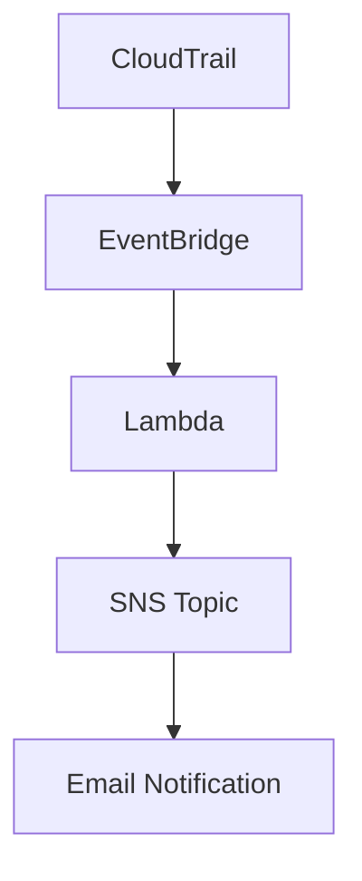

## Project Overview

This project demonstrates an end-to-end, event-driven notification flow using AWS managed services. The core components and their interactions are described below:

### Architecture Flow

### How It Works

- **CloudTrail** records AWS API calls and resource changes, such as the creation of an S3 bucket.
- **EventBridge** listens to CloudTrail logs for specific events (e.g., `CreateBucket`).
- When a relevant event occurs:
  - **EventBridge** triggers the **Lambda** function.
  - The **Lambda** function acts as an intermediate processor (no heavy processing in this version).
  - **Lambda** automatically triggers an **SNS Topic** as its destination.
- **SNS Topic** is configured to send an **email notification**.
- **Result:** Whenever an S3 bucket is created, an email alert is sent, confirming the Lambda was triggered by the event.

### Key AWS Services Used

- AWS CloudTrail
- Amazon EventBridge
- AWS Lambda
- Amazon SNS
- Amazon S3 (as the event source)

---

## How This Application Uses AWS Lambda

### Purpose
AWS Lambda serves as the core compute service in this application. Its main role is to act as an event-driven processor that responds automatically to specific AWS resource creation events (such as the creation of an S3 bucket).

### Trigger Mechanism
- The Lambda function is **not invoked manually**. Instead, it is triggered automatically by **Amazon EventBridge**.
- **EventBridge** is configured to listen for specific events in **CloudTrail** logs, such as the `CreateBucket` event for S3.
- When such an event is detected, EventBridge invokes the Lambda function.

### Lambda Function Logic
- The Lambda function in this project is intentionally lightweight.
- Upon invocation, it does not perform any heavy computation or transformation.
- Its primary responsibility is to act as a bridge: it receives the event and immediately triggers an **SNS Topic**.
- This design ensures minimal latency and leverages AWS managed services for reliability and scalability.

### Permissions
- The Lambda function is granted the necessary IAM permissions to:
  - Be invoked by EventBridge.
  - Publish messages to the SNS topic.
- These permissions are defined using AWS IAM roles and policies, ensuring secure and least-privilege access.

### Integration with Other AWS Services
- **EventBridge**: Triggers the Lambda function based on CloudTrail events.
- **SNS**: Receives notifications from Lambda and sends out email alerts.
- **S3**: Acts as the event source (when a new bucket is created).

### Summary
By using AWS Lambda in this way, the application achieves a fully managed, serverless, and event-driven architecture. This approach minimizes operational overhead, scales automatically, and ensures that notifications are sent reliably whenever relevant AWS resource events occur.

---
